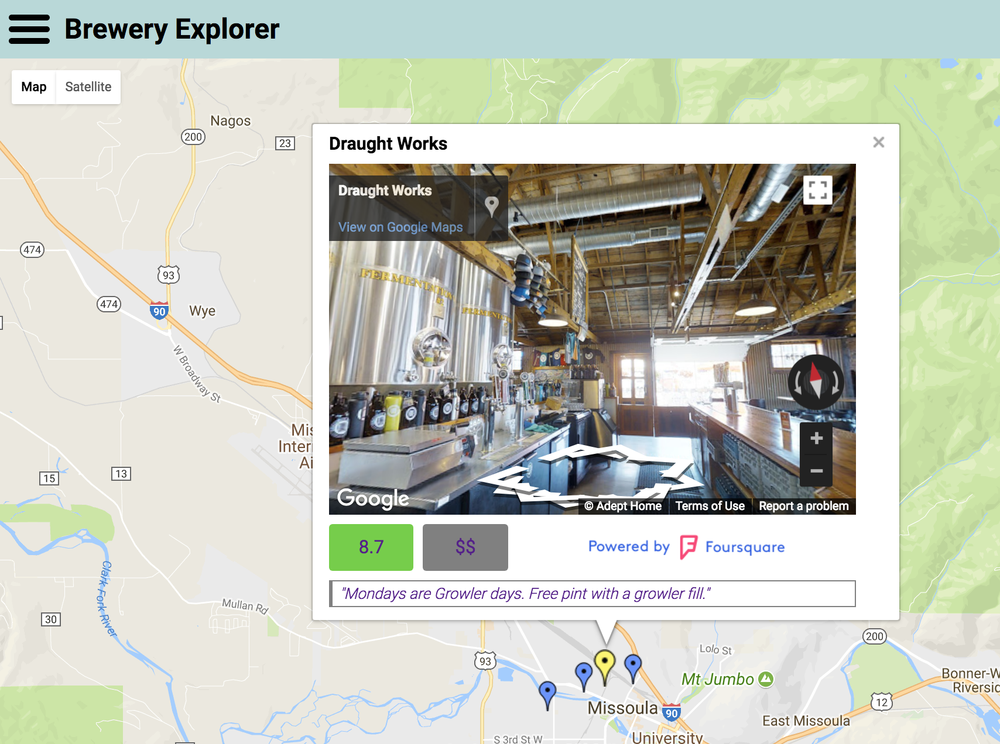

# Project 5: Neighborhood Map

This project uses the [Knockout.js](http://knockoutjs.com/) framework's MVVM pattern. The project uses the Google Maps API, Google Street View API, and Foursquare API to display interactive data about breweries located in Missoula, Montana, USA. Both the [jQuery](https://jquery.com/) and [Slideout.js](https://slideout.js.org/) libraries were used to construct this SPA. The CSS Grid Layout is used to render the app responsively for different screen sizes and orientations. The app is bundled for deployment with a [Webpack](https://webpack.github.io/) and [Babel](https://babeljs.io/) build system.



## Motivation

This project is the fifth in a series of projects I am completing for Udacity's [Full Stack Web Developer Nanodegree](https://www.udacity.com/course/full-stack-web-developer-nanodegree--nd004).

## Getting Started

These instructions will explain how to get a copy of this project running on your local machine. A live deployment of this project is deployed [here](https://ewhanley.github.io/fsnd-neighborhood-map/).

### Prerequisites

* [Node.js](https://nodejs.org/en/)

### How to Run Project

1. If you don't already have node, you can install it with one of the binaries provided [here](https://nodejs.org/en/download/). If you use a package manager, instructions can be found [here](https://nodejs.org/en/download/package-manager/).

2. Download or clone this repository to your machine and navigate to the project directory:

  ```bash
  
  > git clone https://github.com/ewhanley/fsnd-neighborhood-map.git
  > cd fsnd-neighborhood-map
  ```
  
 3. Install the required dependencies by typing:
 
  ```bash
  
  > npm init
  ```
  
4. To open the project locally, you have two options:
  1. Build the project by typing:
  
    ```bash
    
    > npm run build
    ```
    
    Then open ```dist/index.html```.
  
  2. Run the app locally with a development server that provides live reloading. Type:
  
    ```bash
    
    > npm start
    ```
    
    and visit [http://localhost:8080/](http://localhost:8080/).

### Notes
